# Research Assistant

[](https://github.com/BuseDuygun22/research-assistant/actions/workflows/ci_S.yml)

A retrieval-augmented research assistant for the fraud-detection literature. Ask a question, and it returns a draft in which every factual claim is tied to a verifiable span of a source paper, or it says plainly that the corpus cannot answer, or it hands the case to a human with the reason attached.

The interesting part is not that it retrieves and writes. It is that the system **checks itself and measures itself**: an editor that diagnoses *why* a draft failed and routes the repair to the right component, a judge that is calibrated against human labels, and a promotion gate that refuses to call a change an improvement unless the statistics support it.

- [What it does](#what-it-does)
- [Architecture at a glance](#architecture-at-a-glance)
- [Design principles](#design-principles)
- [Components](#components)
  - [1. Corpus and ingestion](#1-corpus-and-ingestion)
  - [2. Hybrid retrieval](#2-hybrid-retrieval)
  - [3. Reranker and the DPO improvement loop](#3-reranker-and-the-dpo-improvement-loop)
  - [4. Contracts: the seam between the two tracks](#4-contracts-the-seam-between-the-two-tracks)
  - [5. Tool layer: MCP server and HTTP API](#5-tool-layer-mcp-server-and-http-api)
  - [6. LLM access layer](#6-llm-access-layer)
  - [7. Agent graph](#7-agent-graph)
  - [8. Judge](#8-judge)
  - [9. Evaluation and the promotion gate](#9-evaluation-and-the-promotion-gate)
  - [10. Observability](#10-observability)
  - [11. CI/CD and deployment](#11-cicd-and-deployment)
- [Repository layout](#repository-layout)
- [Quickstart](#quickstart)
- [Configuration](#configuration)
- [Project status](#project-status)
- [Known limitations](#known-limitations)
- [Working on this repository](#working-on-this-repository)
- [Documentation index](#documentation-index)
- [References](#references)

---

## What it does

```text
question ──► retrieve evidence ──► judge the evidence ──► write a cited draft ──► verify the draft
                    ▲                      │                        ▲                    │
                    └── retrieve again ────┘                        └── repair wording ──┤
                                                                                         ▼
                                                        accept  ·  abstain  ·  hand over to a human
```

A real run on the built-in test corpus, printed from the agent's own trace:

```text
outcome:     accepted
trajectory:  write(evidence_ok) -> accept(passed)
```

Every step in that trajectory carries a machine-readable trigger and a human-readable reason, so an unexpected outcome can be explained after the fact without re-running anything.

The system has three possible endings, and all three are first-class:

| Ending | Meaning |
|---|---|
| **Accept** | The draft is grounded in retrieved evidence and answers the question. |
| **Abstain** | The corpus does not contain an answer. Saying so is the correct output, not a failure. |
| **Escalate** | The system is unsure, hit a budget, or met something it does not recognise. A person receives a handover naming the cause and the next step. |

The corpus is 30 arXiv papers on machine-learning methods for fraud detection (credit-card, review and e-commerce, customs and occupational fraud), 2016 to 2026. What is in and out of scope, and why, is written down in [`docs/domain_brief_B.md`](docs/domain_brief_B.md).

---

## Architecture at a glance

Work is split across two tracks that meet at a small set of explicit contracts. File suffixes record ownership: `_B` Track A (Buse), `_S` Track B (Sude), `_J` joint.

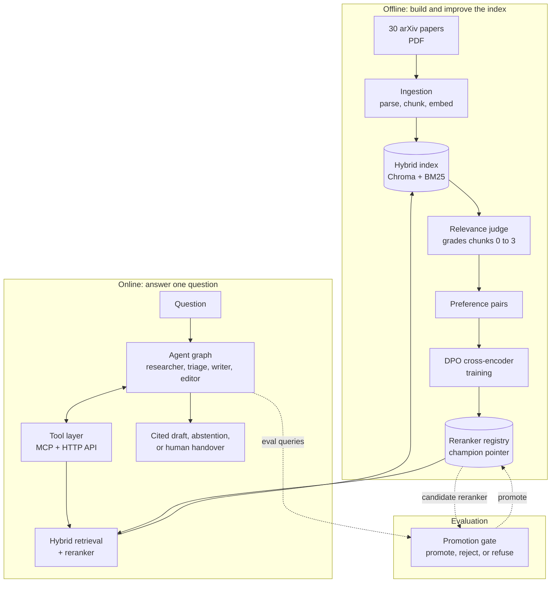

The loop that makes this a research project rather than a demo: the judge turns retrieved chunks into preference pairs, the pairs train a better reranker, the registry swaps it in behind an unchanged interface, and the gate decides whether it earned promotion.

---

## Design principles

Nothing here is included because it is conventional. Each decision below is recorded with the reasoning that supports it, and tagged so it can be challenged.

| Tag | Meaning |
|---|---|
| **[P]** | Published paper |
| **[B]** | Benchmark or measured report |
| **[E]** | Engineering constraint we can demonstrate with a test or measurement |
| **[D]** | Team decision with no external evidence, recorded so it can be revisited |

| Principle | What it means here | Why |
|---|---|---|
| **Control flow is code, not a model call** | Routing, budgets and escalation are pure functions of verdicts and counters. A model classifies; application logic decides what happens next. | A sampled control flow cannot be budgeted, tested or reproduced in a CI gate. **[E]** Incorrect verification and stopping before the task is done are among the most common multi-agent failure modes. **[P]** |
| **Repair by cause, not by retry** | A violation is *shallow* (wording, citation, hedging) or *deep* (the evidence is absent or contradicted). Shallow goes back to the writer; deep goes back to retrieval. | A writer asked to fix an unsupported claim without new evidence can only delete it or invent support. Revision repairs shallow errors and compounds deep ones. **[P]** |
| **Fail closed** | An unrecognised violation kind, an unparseable verdict, or a spent budget escalates. Nothing falls through to a default branch. | The dangerous failures are the silent ones. **[E]** |
| **Judge the evidence before writing** | A triage step assesses the retrieved passages first and can abstain or retrieve again without spending a writer call. | Given irrelevant passages a model writes a fluent, confident answer anyway, and nothing downstream looks wrong. **[P]** |
| **Abstention is a routed edge** | "The corpus cannot answer" has its own route and its own metric, not a line in a prompt. | Telling a model it may abstain does not make it abstain when the context looks plausible. **[P]** |
| **Measure the measurement** | The gate uses paired bootstrap intervals, corrects for multiple metrics, and refuses to compare runs that are not comparable. | A point-estimate comparison promotes noise. **[B]** |
| **The default backend is free and deterministic** | A stub LLM and stub retrieval are the default. Real models are opt-in. | A gate that costs money on every push gets skipped, and a non-deterministic judge cannot support a promote/reject decision. **[E]** |
| **Identity is derived, not assigned** | A chunk's id is a hash of its paper, character span and text. | Hand-labelled relevance judgements are keyed to chunk ids. If a re-ingest reshuffles ids, every label rots silently. **[E]** |
| **Provenance at claim level** | Each claim links to the exact chunk and character span that supports it. | A citation that names a paper but not a span cannot be checked. **[P]** |
| **Never raise across a boundary** | Tools return a typed error saying whether a retry is worthwhile and what to try instead. | An agent given a stack trace cannot recover; one given a remediation can. **[E]** |

---

## Components

### 1. Corpus and ingestion

*Track A. Turns PDFs into chunks with citable coordinates.*

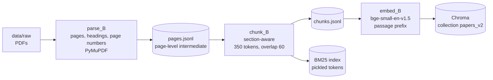

| Decision | Reasoning |
|---|---|
| **The intermediate unit is a page** | Page-level records let every chunking experiment re-run without re-parsing, and they are what make page-range citations possible at all. **[D][E]** |
| **Thin pages are flagged, never silently dropped** | A page yielding 40 characters is a corpus problem to see, not to hide. |
| **Section-aware chunking with a token budget** | A fact split across two chunks can never be retrieved as one hit, whatever the embedder or reranker. Chunks respect section and paragraph boundaries and a hard token cap. **[D][E]** |
| **A `TITLE > SECTION` prefix on every chunk** | A chunk that reads "we improve on this by four points" is unretrievable without knowing what "this" is. A cheap form of contextual retrieval. |
| **Chunk id is a sha256 of paper, character span and text** | Re-ingesting identical text reproduces the id exactly; a changed chunking strategy produces visibly different ids, a loud failure instead of a quiet one. Enforced in `Chunk.derive_id`. **[E]** |
| **Exact character offsets survive splitting and overlap** | The id hashes the offsets, so an id that drifted from the real span would no longer point at a checkable location. |
| **Preprints and their published versions share a canonical paper id** | Otherwise the same result counts as two independent sources agreeing. |
| **Asymmetric embedding prefixes are enforced by the API shape** | `embed_passages` and `embed_query` are separate functions with separate prefixes. Applying the query instruction to passages, or omitting it on queries, costs accuracy while looking like a mediocre model. |
| **Every stage persists its intermediate** | A chunking sweep never re-parses, and a stage always runs as a prefix of the pipeline so a sweep cannot measure a stale corpus. |

Known corpus weaknesses, stated rather than hidden: parsing is uneven on math-heavy papers, PyMuPDF flattens tables into loose tokens (so questions about table cells test the parser, not retrieval), and three surveys overlap heavily with method papers. See [`docs/domain_brief_B.md`](docs/domain_brief_B.md).

### 2. Hybrid retrieval

*Track A. One entry point, `RetrievalService.retrieve`, returns the shared contract type.*

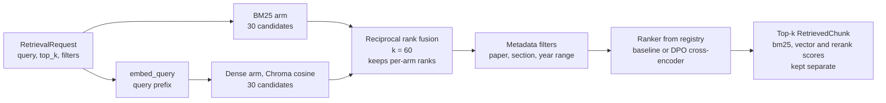

| Decision | Reasoning |
|---|---|
| **Hybrid, not dense-only** | Sparse retrieval misses paraphrase; dense retrieval misses exact identifiers such as a model, dataset or metric name, which is exactly the vocabulary a paper corpus is full of. **[B]** |
| **Reciprocal rank fusion, not weighted score blending** | BM25 scores are unbounded and corpus-dependent; cosine distance is bounded. A weighted sum needs a normalisation constant that must be re-tuned whenever the corpus changes. RRF works on ranks and has no such constant. **[P]** |
| **Fusion keeps each arm's rank** | A trace can say which arm produced a hit, and an ablation needs exactly that signal. |
| **Separate `bm25`, `vector` and `rerank` scores** | Collapsing them makes it impossible to attribute a metric change to one leg. Three columns turn "nDCG went down" into a diagnosable event. **[E]** |
| **A candidate pool of about four times `top_k`** | Wide enough for the reranker to rescue a buried positive, narrow enough not to pay cross-encoder latency on a tail that never surfaces. The pool is set in one place. **[B][E]** |
| **The ranker is resolved through a registry** | This is the load-bearing seam: the tuned model replaces the baseline without the retrieval service or the tools changing. |
| **The BM25 index pickles tokens, not the scorer object** | A pickled scorer is tied to the library version; a dependency bump would silently produce an unloadable index. Rebuilding the scorer takes milliseconds at this size. |
| **The vector store is behind a narrow interface** | Nothing outside one module imports Chroma. Swapping to Qdrant changes one file. |

### 3. Reranker and the DPO improvement loop

*Track A consumes the judge's grades; Track B produces them.*

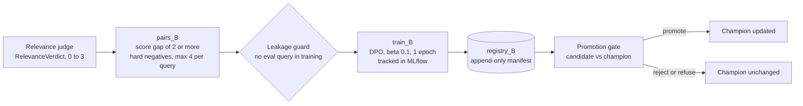

| Decision | Reasoning |
|---|---|
| **A cross-encoder reranks about 20 candidates** | It reads the query and chunk together, so it judges relevance rather than similarity. That is why it can win, and why it only runs over a small pool. **[P]** |
| **DPO on preferences, not regression on grades** | Regressing on 0 to 3 grades would teach the model to reproduce the judge's scale, noise included. DPO only asks that the chosen chunk beat the rejected one. **[P]** |
| **A minimum score gap between chosen and rejected** | A pair whose gap is inside the judge's own test-retest jitter trains the model on noise. The value is chosen empirically, and the config says how far that evidence goes. |
| **Hard negatives only, drawn from the same candidate set** | "Relevant chunk versus a random chunk from another paper" is separable by lexical overlap alone and teaches nothing the fusion ranker did not know. |
| **Pairs per query are capped** | Otherwise a handful of verbose queries dominate the loss. |
| **The leakage guard raises rather than warns** | A reranker trained on its own test set scores well, and that failure looks exactly like success. It is checked before any pair is built, and again by a shared test. |
| **The registry is append-only, and promotion is separate from registration** | Rollback is editing one line, never retraining a model that was silently overwritten. Training registers; only the gate promotes. |
| **The manifest is a JSON file in the repo** | The gate must read it in CI with no credentials and no running service. |
| **A baseline ranker exists as a class, not as "do nothing"** | It exposes the same interface as a tuned model, so the comparison contains no plumbing difference. |

The first trained reranker may well lose to the baseline. That is a legitimate result, it belongs in the report, and the registry and gate exist to stop it shipping.

### 4. Contracts: the seam between the two tracks

*Shared Pydantic models. A change here changes what both sides build against, so joint files are changed only by agreement.*

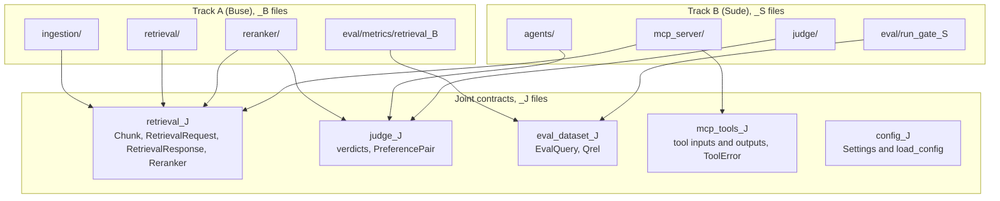

| Seam | Provider | Consumer | Contract |
|---|---|---|---|
| `retrieve(RetrievalRequest) -> RetrievalResponse` and `get_chunk(id)` | `RetrievalService` (A) | tool layer (B) | `retrieval_J` |
| `Reranker.rerank` / `Ranker.rank` | ranker registry (A) | retrieval service (A), gate (B) | `retrieval_J` |
| `RelevanceVerdict -> PreferencePair` | relevance judge (B) | pair builder, trainer (A) | `judge_J` |
| `ndcg_at_k`, `mrr`, `recall_at_k` | retrieval metrics (A) | promotion gate (B) | `eval_dataset_J` |
| `EvalQuery` and `Qrel` JSONL | frozen eval set (A) | promotion gate (B) | `eval_dataset_J` |
| `Settings` and `load_config` | both | both | `config_J` |

Design choices worth knowing:

- **Every verdict carries `JudgeMeta`** (model, prompt version, temperature). Without it a metric shift cannot be attributed to the system versus a judge-prompt edit. **[E]**
- **The gate refuses to compare runs whose `corpus_version`, `embedding_model` or `reranker_version` differ.** Otherwise a "+4 nDCG" that was really a corpus change gets promoted.
- **`Qrel.labeler` has no default.** A label must name who made it; agreement between annotators cannot be computed from one implicit annotator.
- **The violation taxonomy is checked at import.** Every kind must be classified shallow or deep, or the module refuses to load, so a new kind cannot be routed by accident.

### 5. Tool layer: MCP server and HTTP API

*Track B. Three tools, with the logic behind plain HTTP and the MCP layer as a thin protocol adapter.*

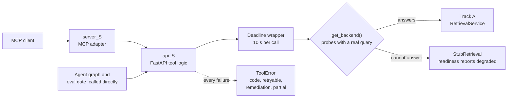

| Tool | Purpose |
|---|---|
| `search_papers` | Ranked chunks for a question, with separate bm25 / vector / rerank scores and a `chunk_id`. |
| `get_citation` | A formatted citation plus the **verbatim supporting span** for a chunk. |
| `summarize_section` | A summary of chosen chunks, optionally toward a focus question. Returns a partial result plus an error if only some ids exist. |

| Decision | Reasoning |
|---|---|
| **A real MCP server over a FastAPI service** | The logic is testable with `TestClient` without speaking MCP, the gate and agents call it directly instead of spawning a session per query, and a protocol change is a one-file change. **[D][E]** |
| **Tools never raise across the boundary** | They return `ToolError` with `retryable`, a `remediation` saying *which* retry is worth making, and `partial` when usable results came back alongside the error. |
| **`get_citation` returns the verbatim span and its offsets** | Verification becomes a short local comparison instead of a whole-document one. **[P]** |
| **Every tool call has a deadline** | A hung backend is the one failure an agent cannot observe: no error, no budget spent, no escalation. The deadline turns it into an ordinary retryable error. |
| **Liveness and readiness are separate** | The process answers immediately but is ready only once a backend can answer a query. Collapsing them lets a deploy go green with no index. |
| **Backend selection probes with a real query** | Importing a retrieval service is not the same as being able to serve. A backend that imports but cannot answer must fall back to the stub, loudly. |
| **Three tools, each with a worked example in its description** | Concrete examples measurably improve an agent's parameter handling, and schema bloat is a real context tax. **[B]** |

### 6. LLM access layer

*One protocol, four backends, chosen once from settings.*

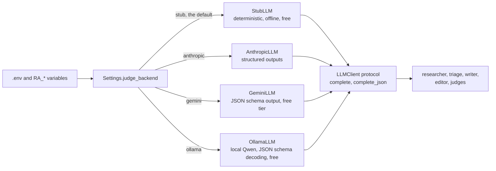

- **Nothing above this module names a provider.** Swapping or adding a provider is one class.
- **The stub is the CI backend, not a placeholder.** It is deterministic, so the pipeline's plumbing is tested on every push while quality numbers come from scheduled runs against a real model.
- **Structured output is validated locally.** Both real clients constrain the model to the schema and then validate with Pydantic; a refusal, a truncation, a safety block or an out-of-range value all become one `LLMError`, which every caller already treats as "a verdict I do not have".
- **Model-generation quirks are handled where they occur.** Claude 5 models reject sampling parameters, so none are sent; thinking counts toward the token cap, so small caps are floored.

### 7. Agent graph

*Track B. Four working nodes and one terminal handover, sharing one immutable state object.*

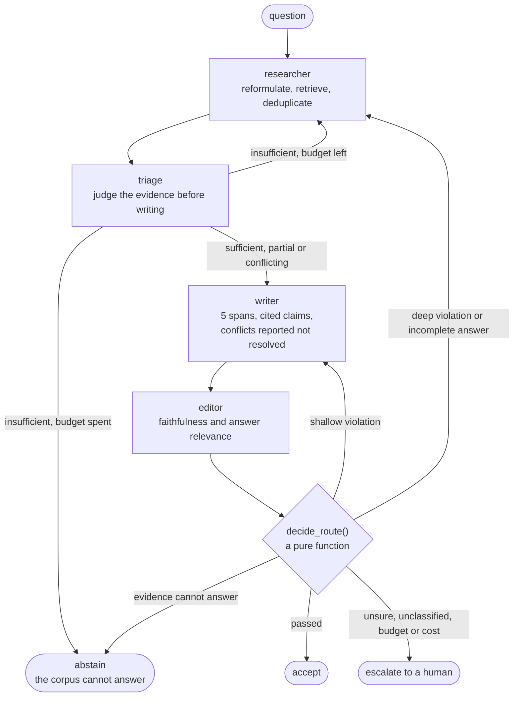

**Routing.** `decide_route` checks in a deliberate order, and each position is defended:

| Order | Check | Result | Why here |
|---|---|---|---|
| 1 | Step budget exhausted | escalate | A global backstop first, so a bug below cannot loop forever. |
| 2 | Cost ceiling (opt-in) | escalate | When finishing costs more than a person would, stop. |
| 3 | Unclassified violation | escalate | Fail closed. Never default an unknown kind to a branch. |
| 4 | Verdict confidence below threshold | escalate | A pass the judge is unsure about is not a confident pass. |
| 5 | Evidence cannot answer | abstain | More retrieval over a corpus that lacks the answer only gives a more confident wrong answer. |
| 6 | Faithfulness failed | rewrite or re-retrieve, by depth | Grounding comes before usefulness. |
| 7 | Draft grounded but does not answer | re-retrieve | This is what stops the gate rewarding a timid, perfectly cited non-answer. |

**Violations and where they go.**

| Kind | Depth | Repaired by |
|---|---|---|
| `missing_citation` | shallow | writer, attaches the citation |
| `overstated_certainty` | shallow | writer, hedges the claim |
| `misattributed_citation` | shallow | writer, swaps to the correct chunk |
| `unsupported_claim` | **deep** | researcher, needs new evidence |
| `inferential_leap` | **deep** | researcher, the source supports A but the draft asserts B |
| `contradicts_source` | **deep** | researcher, or drop the claim |

**State.** The shared state is frozen. Each field has a declared owner, and writing a field you do not own raises, because a field written by the wrong node invalidates every verdict derived from it.

| Field | Written by |
|---|---|
| `evidence`, `queries_issued` | researcher |
| `draft`, `claims` | writer |
| `assessment`, `faithfulness`, `answer`, `decisions`, `budget` | editor (and triage for `assessment`) |
| `outcome` | editor, flag_for_human |

| Decision | Reasoning |
|---|---|
| **Separate budgets for rewrites and re-retrievals** | A rewrite is one writer call; a re-retrieval is a retrieval round, a rerank and a writer call. One shared counter lets cheap rewrites starve the expensive repair that would have worked. Defaults are 3 rewrites, 2 re-retrievals and 12 steps overall, plus a cost ledger. **[D]** |
| **Targeted correction, not regeneration** | The writer receives only the failed claims and their diagnosis, and is told which verified claims to keep. Regenerating correct prose gives it a fresh chance to break. |
| **Only five spans reach the writer** | Retrieve wide, deliver narrow. Accuracy degrades with context length, worst in the middle, and semantically similar distractors, which a single-topic corpus is full of, make it worse. **[P][B]** |
| **Retrieval and generation are separate agents** | The writer has no retrieval tool, so an evidence gap surfaces as a violation instead of being quietly papered over. |
| **A conflict is reported, not resolved** | Two passages that disagree, or one superseding another, are passed to the writer as an instruction to say so. Left alone a model silently picks a side and the draft is faithful to the side it picked. |
| **Reformulated queries must be novel** | A token-overlap check rejects a near-repeat. A repeated query burns the most expensive budget for nothing. |
| **History is kept, not compacted** | Prior drafts and verdicts stay addressable by id. Summarising them is lossy and drops constraints stated early. **[B]** |
| **Escalation explains itself** | Each terminal trigger has a next-step message: a labelling task, a bug report, a tuning question or a corpus gap. |
| **Two runners, one policy** | A plain loop (used by tests and the gate) and a LangGraph adapter both call the same routing function, so the framework cannot change what the system decides. |

### 8. Judge

*Track B. One judging subsystem with several uses.*

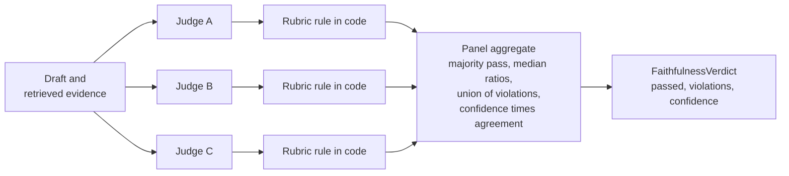

| Judge | Question it answers |
|---|---|
| **Relevance** | How well does this chunk answer this query, 0 to 3 (the TREC scale, same as the human labels)? Feeds the preference pairs. |
| **Faithfulness** | Is every claim in the draft supported by the span it cites? Feeds the editor. |
| **Answer relevance** | Does the draft answer the *question*, and could the evidence have? Catches the perfectly cited draft that answers nothing. |
| **Triage** | Before writing: can these passages answer the question, and do any two contradict each other? |

| Decision | Reasoning |
|---|---|
| **`passed` is computed by a rule, not reported by the model** | A model asked "did you pass?" is grading its own work. The rubric turns counted violations into a decision anyone can audit: no deep violation, no major shallow violation, citation precision at least 0.95, coverage at least 0.80. See [`docs/editorial_rubric_S.md`](docs/editorial_rubric_S.md). **[D]** |
| **Faithfulness and answer relevance are separate calls** | Attribution and usefulness are independent. A draft of five verbatim quotes scores perfectly on the first and zero on the second, so a gate on faithfulness alone rewards saying nothing. |
| **Claims are decomposed, then verified one by one** | This makes citation precision computable rather than impressionistic and keeps each check short. Granularity is measured, because attribution is reported to peak at an intermediate size. **[P]** |
| **Chunks are graded independently, in a deterministic shuffled order** | Position bias in pairwise judging is measured and systematic. Absolute grading removes the comparison it attaches to. **[P]** |
| **A panel of diverse judges, not one large judge** | A single model shares its biases with itself and can be consistent and consistently wrong. Independent judges cannot share an idiosyncratic bias, and their disagreement lowers the panel's confidence, which feeds escalation. **[P]** |
| **Calibration against human labels** | Cohen's kappa and Krippendorff's alpha with the confusion matrix, temperature scaling, and reliability bins that show which way the judge errs. The threshold suggester returns nothing rather than 1.0 when no threshold is good enough. **[P][B]** |

The panel and the calibration tools are implemented and tested. The editor currently uses a single judge, and `escalation_confidence` ships at 0.0, because a threshold on an uncalibrated number is not defensible. Both are switched on once the judge has been calibrated against real labels.

### 9. Evaluation and the promotion gate

*Track A defines the metrics and the eval set; Track B decides promote, reject or refuse.*

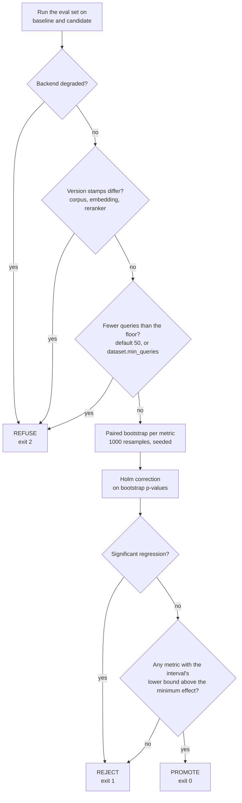

Metrics are grouped by what they protect, because they fail independently:

| Family | Metrics | Owner |
|---|---|---|
| **Retrieval** | nDCG@5, MRR, recall@20, and a retrieval-side citation precision (the share of returned chunks graded useful) | Track A |
| **Attribution** | claim-level citation precision (the share of cited claims the source actually supports) and citation coverage | Track B |
| **Utility** | answer relevance, abstention recall, abstention precision, over-abstention rate | Track B |
| **Process** | revision counts, first-pass accept rate, escalation rate, triggers per run | Track B |
| **Diagnostics** (reported, never gated) | claim granularity, cost spent | Track B |

| Decision | Reasoning |
|---|---|
| **Four retrieval metrics, not one** | nDCG collapses two different diseases into one number. `recall@20` is a *ceiling*: the reranker cannot recover a chunk that search never returned, so low recall means the fix is upstream, not in the ranker. **[D]** |
| **Undefined metrics are NaN, never 0.0** | A query with no relevance labels must not silently lower the mean. |
| **Paired comparison** | Baseline and candidate run on the same queries and the per-query difference is resampled. Query difficulty cancels, so the same labels detect a far smaller real effect. **[B]** |
| **Significance is not enough** | A change counts only if the lower bound of its interval clears a minimum effect. With enough queries a +0.002 change becomes detectable and still does not matter. |
| **A regression rejects on significance alone** | A change that measurably makes something worse deserves a look even if the amount is small. Improvements must clear both bars. |
| **Multiple metrics are Holm-corrected** | Four metrics at 5% each is not a 5% false-positive rate, and a gate that cries wolf gets skipped. |
| **Refusal is distinct from rejection** | A reject is an answer. A refusal means the question could not be asked: a stub backend, mismatched stamps, or too few queries. |
| **The eval set is strict and split** | One malformed row fails the gate, because skipping rows silently shrinks the set. The `test` split never touches prompt or reranker selection, enforced by a test rather than by intention. **[E]** |
| **Sensitivity is printed with every verdict** | "The gate went green" is not a finding; "the gate can resolve changes of at least 0.04" is. |
| **The gate's statistics are standard-library only** | No numpy, no scipy in the bootstrap, Holm correction or sizing code. A gate with an install step breaks on the one push where it matters. |

The eval set's size is a quantity with a right answer. About 200 queries resolve a 4% nDCG change at a typical per-query spread; a 3% change needs closer to 550. Measure the real spread on a small pilot first.

### 10. Observability

*Tracing primitives that can be applied everywhere because they cannot break anything.*

- `@traced` and `span()` degrade to structured logs when Langfuse is not configured, and cost one attribute lookup when disabled. Instrumentation never raises, which is what makes it safe to decorate every tool, judge call and agent node. **[E]**
- Every routing decision records its trigger, reason, budget snapshot and cost, so a trajectory is readable without a re-run, and the gate turns trajectories into metrics.
- The tracing primitives are adopted across Track B; extending them across ingestion and retrieval is what gives a single trace for the whole request, and is still to do.

### 11. CI/CD and deployment

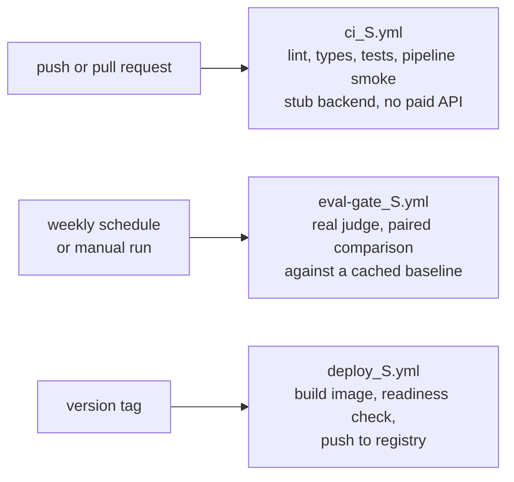

- **Two workflows, two questions.** `ci_S.yml` asks "does it run" on every push, cheaply and deterministically. `eval-gate_S.yml` asks "did it get better", on a schedule and on demand, because a gate on every push is either cheap and meaningless or expensive and skipped.
- **Exit codes are meaningful.** 0 promote, 1 reject, 2 refused. A refusal is never read as a quality signal in either direction.
- **The deploy job gates on readiness, not liveness.** A container is live when the process answers and ready only when a backend can serve; deploying on liveness alone is how a service goes green with no index behind it.
- **The image runs as a non-root user** and the build context excludes the local environment and any `.env`.

---

## Repository layout

Suffixes record ownership: `_B` Track A (Buse), `_S` Track B (Sude), `_J` joint.

```text
research-assistant/
├── src/research_assistant/
│   ├── contracts/          # _J   shared Pydantic contracts (the seam)
│   ├── config_J.py         # _J   Settings (RA_* env) and YAML config loading
│   ├── llm_S.py            # _S   LLM protocol: stub, Ollama, Anthropic, Gemini
│   ├── prompts_S.py        # _S   few-shot response-format examples per prompt
│   ├── ask_S.py            # _S   `python -m research_assistant.ask_S` — the pipeline CLI
│   ├── ingestion/          # _B   parse, chunk, embed, pipeline
│   ├── retrieval/          # _B   BM25, vector store, RRF fusion, service
│   ├── reranker/           # _B   baseline, preference pairs, DPO training, registry
│   ├── judge/              # _S   relevance, faithfulness, triage, panel, calibration
│   ├── agents/             # _S   graph, nodes, state, routing
│   ├── mcp_server/         # _S   FastAPI logic, MCP adapter, backends, deadlines
│   └── observability/      # _S   tracing primitives
├── eval/
│   ├── metrics/            #      retrieval_B, generation_S, significance_S
│   ├── run_gate_S.py       # _S   the promotion gate
│   ├── datasets/           # _B   queries, qrels, drafts
│   └── thresholds_B.yaml   # _B   promotion thresholds
├── configs/                #      ingestion, retrieval, reranker, agents
├── scripts/                #      ingest, pairs, train, serve, label, smoke-test,
│                           #      calibrate_judge_S (judge kappa vs. human labels)
├── notebooks/              # _B   stage-by-stage reasoning, 00 to 10
├── docs/                   #      architecture, contracts, rubric, reviews, guides
├── tests/                  #      unit, contract, integration, adversarial fixtures
├── docker/                 # _S   image and compose file
├── .env.example            #      every RA_* setting, safe defaults, no real keys
└── .github/                # _S   CI, eval gate, deploy, CODEOWNERS, PR template
```

The notebooks in `notebooks/` hold the reasoning and the rejected alternatives for each Track A stage; the modules in `src/` are the promoted, tested versions.

---

## Quickstart

Requires Python 3.11. MLflow runs are stored in `mlflow.db` (SQLite); browse them with `make mlflow`. MLflow 3.16 and later refuse the old file store, so the repository uses SQLite.

```bash
python -m venv .venv
source .venv/bin/activate            # Windows: .venv\Scripts\activate
pip install -e ".[serve,agents,judge,dev]"
```

The base install includes Track A's dependencies (PyMuPDF, sentence-transformers, Chroma, rank-bm25). Optional groups: `train` (torch, trl, peft, for DPO), `notebooks`, `obs` (Langfuse). `make install-all` installs everything the pipeline, agents, tests and CI need except `train`.

Copy `.env.example` to `.env` and edit it; every setting has a safe default, and `.env` is gitignored so real keys never get committed.

**Run the tests.** They use the stub LLM and stub retrieval regardless of your local configuration.

```bash
python -m pytest -q
ruff check src eval tests scripts
mypy src eval
```

**Build the real index first** (the PDFs and index live in `data/`, which is gitignored, so every clone builds its own).

```bash
python scripts/fetch_arxiv_fraud_B.py --n-papers 30     # fetch the corpus
python scripts/ingest_B.py --stage all                  # parse, chunk, embed, index
```

Or, to try the pipeline with no download, `make demo` indexes seven synthetic PDFs and asks a question.

**Ask a question.** This is the whole pipeline: hybrid retrieval, triage, a cited draft, faithfulness and relevance judging, routing. The result is a cited answer, an abstention, or a handover to a person.

```bash
python -m research_assistant.ask_S "Which methods handle class imbalance in fraud detection?"
python -m research_assistant.ask_S --json --mlflow "..."     # machine-readable, and logged to MLflow
```

Exit code 0 means answered, 3 abstained (the corpus has no answer), 4 escalated to a person. Without an index it falls back to the stub corpus and says so (`RA_RETRIEVAL_BACKEND=track_a` makes that an error instead).

**Serve the tools.**

```bash
python scripts/serve_S.py api             # HTTP API on :8000
python scripts/serve_S.py mcp             # MCP server

curl -s -X POST localhost:8000/tools/search_papers \
  -H "content-type: application/json" \
  -d '{"query": "class imbalance in fraud detection", "top_k": 3}'
```

Check `/ready` before trusting any number. `degraded` means a stub backend is serving and results are not publishable.

**Use a local model (Qwen through Ollama): free, offline, nothing leaves the machine.** Install Ollama from ollama.com, then:

```bash
ollama pull qwen2.5:7b-instruct        # about 4.7 GB; use qwen2.5:3b-instruct on a small machine
python -m research_assistant.ask_S --llm ollama --model qwen2.5:7b-instruct "..."
```

Or set it once in `.env`:

```ini
RA_JUDGE_BACKEND=ollama
RA_JUDGE_MODEL=qwen2.5:7b-instruct
```

Small local models drift from a JSON contract more than hosted ones do, so every prompt carries worked examples of the exact response shape (`src/research_assistant/prompts_S.py`), the request asks Ollama to constrain decoding to the schema, and a bad reply gets one retry with the validation error fed back. Expect judging to be slower and noisier than a hosted model: treat local-model verdicts as a development tool, and calibrate the judge against the human labels before trusting a promote/reject decision.

**Use a hosted model.** Create a `.env` file in the repository root. It is gitignored; never commit it.

```ini
RA_JUDGE_BACKEND=gemini
RA_JUDGE_MODEL=gemini-2.5-flash
RA_GEMINI_API_KEY=your-key-here
```

```bash
python scripts/smoke_real_model_S.py
```

Free tiers are rate-limited (the newest Gemini model allowed 5 requests a minute and a small daily cap when tested), so the smoke test paces itself and a full evaluation run needs a paid tier or a local model.

**Run the promotion gate.**

```bash
python -m eval.run_gate_S --split dev --baseline .eval/baseline.json --out .eval/current.json
```

Exit code 0 means promote, 1 reject, 2 refused.

---

## Configuration

Settings are read from the environment (prefix `RA_`) and from `.env`. Corpus and model choices live in `configs/*.yaml` so they are version-controlled and diffable in a pull request.

| Variable | Default | Purpose |
|---|---|---|
| `RA_JUDGE_BACKEND` | `stub` | `stub`, `ollama`, `anthropic` or `gemini`. |
| `RA_OLLAMA_BASE_URL` | `http://127.0.0.1:11434` | Where Ollama listens. |
| `RA_OLLAMA_TIMEOUT_SECONDS` | `300` | Local generation is slow; be generous. |
| `RA_OLLAMA_NUM_CTX` | `8192` | Context window; Ollama's own default of 4096 truncates a five-passage prompt. |
| `RA_RETRIEVAL_BACKEND` | `auto` | `auto` probes Track A with a real query and falls back to the stub; `stub` pins the stub; `track_a` requires the real service and never falls back. |
| `RA_JUDGE_MODEL` | `claude-sonnet-5` | Model id. **Set it to match the backend.** |
| `RA_GEMINI_API_KEY`, `RA_ANTHROPIC_API_KEY` | unset | Provider keys. |
| `RA_MAX_REWRITES` / `RA_MAX_RE_RETRIEVALS` / `RA_MAX_STEPS` | `3` / `2` / `12` | Separate budgets plus a global backstop. |
| `RA_WRITER_TOP_K` | `5` | Spans delivered to the writer. Raising it is the easiest way to quietly make drafts worse. |
| `RA_TOOL_DEADLINE_SECONDS` | `10` | Per-tool wall-clock budget. `0` disables. |
| `RA_ESCALATION_CONFIDENCE` | `0.0` | Confidence below which a verdict escalates. Keep at 0 until the judge is calibrated. |
| `RA_COST_AWARE_ESCALATION` | `false` | Escalate when finishing would cost more than a human review. |
| `RA_MCP_TRANSPORT` | `stdio` | `stdio` or `sse`. |
| `RA_TRACING_ENABLED` | `false` | Enable Langfuse tracing. |
| `RA_CORPUS_VERSION` / `RA_EMBEDDING_MODEL` | from `configs/` | Default to the values ingestion actually used, so they cannot silently drift. |

---

## Project status

| Area | State |
|---|---|
| Ingestion, chunking, embedding, hybrid retrieval | Implemented and tested. The 30-paper corpus was ingested locally; the data is gitignored and rebuilt with the commands below. |
| Reranker registry, baseline ranker, pair builder, DPO trainer | Implemented and tested. No reranker has been trained yet; that needs real judge scores. |
| MCP server, HTTP API, tool errors, deadlines | Implemented and tested. |
| Agent graph, triage, conflict handling, routing, budgets | Implemented and tested, including an adversarial corpus. |
| Judge: relevance, faithfulness, answer relevance, triage | Implemented. Smoke-tested on a real model over a small corpus. |
| Judge panel and calibration tools | Implemented and tested on synthetic data. Not yet wired into the editor, and not yet fitted to real labels. |
| Promotion gate and significance machinery | Implemented and tested. |
| **Frozen eval set** | **In progress.** Draft pools exist; the frozen `queries_B.jsonl` and `qrels_B.jsonl` are still empty pending human labelling against the current chunk ids. |
| Headline results | **Not reported yet.** No numbers are claimed until the eval set is frozen and the judge is calibrated against it. |
| Final report | Not started; it needs the results. |

Integration items still open between the tracks:

- The gate reads only `dataset.min_queries` from `eval/thresholds_B.yaml`. The per-metric minimum effects, absolute floors and regression tolerances in that file are not consumed yet; `--min-effect` still governs.
- Ingestion and retrieval do not yet use the tracing primitives.
- Two different metrics are both called `citation_precision` (Track A: share of returned chunks graded useful; Track B: share of cited claims the source supports), and metric keys differ in spelling (`ndcg_at_5` against `ndcg@5`). One of them should be renamed before per-metric thresholds are wired into the gate.

---

## Known limitations

These are properties of the approach, stated so they are not discovered later.

- **A faithfully cited wrong source is accepted.** Attribution is not truth. If a paper is wrong, or retrieval surfaced only one side of a disagreement, every claim can be supported and the draft still misleads. Detecting this needs reference answers for a subset of the eval set, which do not exist yet.
- **A small corpus.** 30 papers keeps labelling tractable but means metrics could saturate. The domain brief says when to revisit.
- **Tables are not parsed.** Questions about a specific table cell test the parser, not retrieval, and are out of scope.
- **Temperature by role is a design intent, not an implemented behaviour.** All roles share one LLM client. Claude 5 models accept no sampling parameters at all; run-to-run variance of a real judge must be measured rather than assumed to be zero.
- **Real-model evaluation is bounded by cost.** Grading every chunk in a labelled pool means thousands of calls. The stub keeps CI free, but calibration and the DPO run need a paid tier or a local model.
- **Per-claim verification cannot see a join.** "A. B. Therefore C." can pass claim by claim. The claim-granularity diagnostic measures the risk; it does not remove it.

---

## Working on this repository

- **Branches and pull requests.** Work on a branch (`feature/...`, `fix/...`) and open a pull request. The template asks for the evidence behind a change, tagged as above.
- **Joint files.** Anything under `contracts/*_J.py`, plus `config_J.py`, changes only by agreement: additive changes with backward-compatible defaults, reviewed by the other owner, with `docs/contracts_J.md` updated to match.
- **Before opening a pull request.** `pytest`, `ruff check` and `mypy` must pass. If a change could move a metric, run the gate and paste the verdict, including the sensitivity line.
- **Held-out discipline.** The `test` split is for reporting a final number, never for choosing a prompt, a threshold or a model.
- **Secrets.** `.env` is gitignored. Never commit a key, and rotate any key that has been exposed.
- **Tests are hermetic.** The suite pins both the stub LLM and the stub retrieval backend regardless of local configuration, so neither a developer's `.env` nor a locally built index can change what `pytest` does.

---

## Documentation index

| Document | What it covers |
|---|---|
| [`docs/architecture_J.md`](docs/architecture_J.md) | The design rationale, stage by stage, with the evidence behind each decision. |
| [`docs/contracts_J.md`](docs/contracts_J.md) | The shared interfaces and the rules for changing them. |
| [`docs/domain_brief_B.md`](docs/domain_brief_B.md) | Corpus scope: what the assistant answers, and what it deliberately does not. |
| [`docs/editorial_rubric_S.md`](docs/editorial_rubric_S.md) | What counts as a faithfulness violation, and how `passed` is derived. |
| [`docs/qrels_labeling_guide_B.md`](docs/qrels_labeling_guide_B.md) | How to grade a chunk 0 to 3, with worked examples. |
| [`docs/design_review_J.md`](docs/design_review_J.md) | A stage-by-stage, principle-by-principle audit with edge cases. |
| [`docs/research_notes_S.md`](docs/research_notes_S.md) | The 2026 literature sweep behind the agent and evaluation design. |
| [`docs/eval_set_gaps_proposal_B.md`](docs/eval_set_gaps_proposal_B.md) | What the eval set still needs. |
| [`README_Buse.md`](README_Buse.md), [`README_Sude.md`](README_Sude.md) | Track-level responsibilities and build order. |
| [`notebooks/README_B.md`](notebooks/README_B.md) | The Track A notebooks, 00 to 10. |

---

## References

- Lewis et al., *Retrieval-Augmented Generation for Knowledge-Intensive NLP Tasks*, 2020. [arXiv:2005.11401](https://arxiv.org/abs/2005.11401)
- Karpukhin et al., *Dense Passage Retrieval for Open-Domain Question Answering*, 2020. [arXiv:2004.04906](https://arxiv.org/abs/2004.04906)
- Cormack, Clarke and Büttcher, *Reciprocal Rank Fusion Outperforms Condorcet and Individual Rank Learning Methods*, SIGIR 2009.
- Nogueira and Cho, *Passage Re-ranking with BERT*, 2019. [arXiv:1901.04085](https://arxiv.org/abs/1901.04085)
- Liu et al., *Lost in the Middle: How Language Models Use Long Contexts*, 2023. [arXiv:2307.03172](https://arxiv.org/abs/2307.03172)
- Rafailov et al., *Direct Preference Optimization*, 2023. [arXiv:2305.18290](https://arxiv.org/abs/2305.18290)
- Zheng et al., *Judging LLM-as-a-Judge with MT-Bench and Chatbot Arena*, 2023. [arXiv:2306.05685](https://arxiv.org/abs/2306.05685)
- Es et al., *RAGAS: Automated Evaluation of Retrieval Augmented Generation*, 2023. [arXiv:2309.15217](https://arxiv.org/abs/2309.15217)
- Gao et al., *Enabling Large Language Models to Generate Text with Citations (ALCE)*, 2023. [arXiv:2305.14627](https://arxiv.org/abs/2305.14627)
- Yan et al., *Corrective Retrieval Augmented Generation*, 2024. [arXiv:2401.15884](https://arxiv.org/abs/2401.15884)
- Cemri et al., *Why Do Multi-Agent LLM Systems Fail?*, 2025. [arXiv:2503.13657](https://arxiv.org/abs/2503.13657)
- Verga et al., *Replacing Judges with Juries: Evaluating LLM Generations with a Panel of Diverse Models*, 2024. [arXiv:2404.18796](https://arxiv.org/abs/2404.18796)

Further 2026 sources, and which decision each one backs, are listed in [`docs/research_notes_S.md`](docs/research_notes_S.md) and [`docs/design_review_J.md`](docs/design_review_J.md), including the work on abstention, knowledge conflicts and citation granularity. Vendor and practitioner sources there are tagged **[B]**, not **[P]**, and several 2026 items are preprints: verify each before it enters a bibliography.
